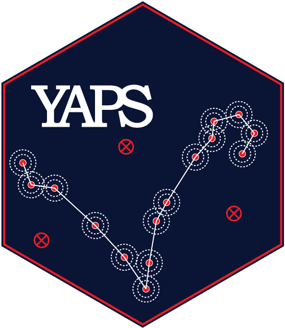
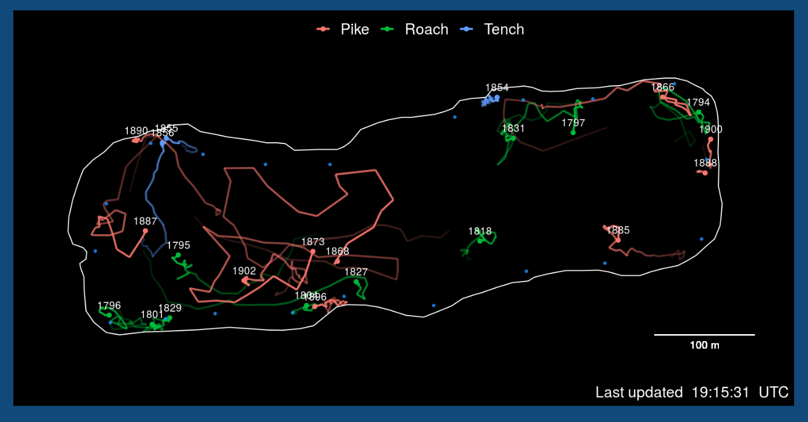

<!-- README_sync.md is generated from README_sync.Rmd. Please edit that file -->
<!-- badges: start -->

[](https://github.com/baktoft/yaps/actions)
[](https://codecov.io/gh/baktoft/yaps?branch=master)
[](https://travis-ci.org/baktoft/yaps)
<!-- badges: end -->

# YAPS - (Yet Another Positioning Solver)

Welcome to the `yaps` repository. The `yaps` package is based on the
original YAPS presented in Baktoft, Gjelland, Økland & Thygesen (2017):
[Positioning of aquatic animals based on time-of-arrival and random walk
models using YAPS (Yet Another Positioning
Solver)](https://www.nature.com/articles/s41598-017-14278-z.pdf)

To use `yaps` on own data, you need to compile a TOA-matrix based on
synchronized hydrophone data and replace the hydros dataframe with
actual hydrophone positions. A complete step-by-step guide on how to do
this, can be found in our pre-print paper [Opening the black box of fish
tracking using acoustic
telemetry](https://www.biorxiv.org/content/10.1101/2019.12.16.877688v1).
The example in this guide is based on data collected using a 69 kHz
PPM-based system (Vemco VR2). We are working towards adding examples
based on data collected using other manufacturers.

## See YAPS in action

We are working towards true live tracking for aquatic animals. Check out
our prototype of [yaps-live](https://baktoft.shinyapps.io/yapslive/) (or
click the screenshot below). The track estimation is done on-the-fly
using `yaps`, but the live-stream of detection data is at the moment
computer generated from manually downloaded data.

[](https://baktoft.shinyapps.io/yapslive/)

## Dependencies

The `yaps` package requires
[devtools](https://CRAN.R-project.org/package=devtools) and
[TMB](https://github.com/kaskr/adcomp). Please see
[instructions](https://github.com/kaskr/adcomp/wiki/Download) on TMB
installation. If working on Windows, you might also need to install
[Rtools](https://cran.r-project.org/bin/windows/Rtools/) as specified in
the TMB documentation.

## Disclaimer

**`yaps` obeys the fundamental rule of “garbage in, garbage out”.
Therefore, DO NOT expect `yaps` to salvage a poorly designed study, nor
to turn crappy data into gold.**  
We have attempted to make both synchronization process and track
estimation user-friendly. However, it is not trivial to synchronize
hydrophones (let alone automating the process) based on detections in a
variable and often noisy environment. Hydrophones might be
replaced/shifted and if not fixed securely, hydrophones might move/be
moved during a study. Additionally, hydrophone performance and output
format varies considerably among (and within) manufacturers. On top of
that, hydrophones don’t always behave and perform as expected. For
instance, some hydrophone models autonomously initiate reboots causing
perturbation of varying magnitude and/or duration of the internal clock
at apparently random time intervals. Therefore, the functions in `yaps`
might perform sub-optimal or even fail miserably when applied to new
data. If/when this happens, please let us know through a direct message
or leave a bug-report. Also note, the to-do list for improvements and
tweaks is long and growing, so stay tuned for updates.

## Installation

Make sure you have the newest version of `yaps` installed. For this, you
need `devtools` installed - if not already installed, run
`install.packages('devtools')`.  
`yaps` relies heavily on use of Template Model Builder
[TMB](https://github.com/kaskr/adcomp) for fitting the models, so make
sure `TMB` is installed and working by following the simple [TMB
instructions](https://github.com/kaskr/adcomp/wiki/Download).  
Then install the latest version of `yaps` with:

``` r
    install.packages("devtools")
    install.packages("TMB")
    TMB::runExample(all=TRUE)
    devtools::install_github("baktoft/yaps")
```

## Processing example data ssu1

The code below is identical to the example workflow presented in
[Opening the black box of fish tracking using acoustic
telemetry](https://www.biorxiv.org/content/10.1101/2019.12.16.877688v1).
See the pre-print for further explantion.

``` r
library(yaps)

# set sync parameters 
max_epo_diff <- 120
min_hydros <- 2
time_keeper_idx <- 5
fixed_hydros_idx <- c(2:3, 6, 8, 11, 13:17)
n_offset_day <- 2
n_ss_day <- 2

# get input data ready for getSyncModel()
inp_sync <- getInpSync(sync_dat=ssu1, max_epo_diff, min_hydros, time_keeper_idx, 
    fixed_hydros_idx, n_offset_day, n_ss_day)

# fit the sync model
sync_model <- getSyncModel(inp_sync, silent=TRUE)

# Plot model residuals and model check plots to ensure the synchronization process was successful...
plotSyncModelResids(sync_model, by='overall')       
plotSyncModelResids(sync_model, by='sync_tag')      
plotSyncModelResids(sync_model, by='hydro')         

plotSyncModelCheck(sync_model, by="sync_bin_sync")  
plotSyncModelCheck(sync_model, by="sync_bin_hydro") 
plotSyncModelCheck(sync_model, by="sync_tag")       
plotSyncModelCheck(sync_model, by="hydro")          

# Apply the synchronization model to all data
detections_synced <- applySync(toa=ssu1$detections, hydros=ssu1$hydros, sync_model)

# Prepare to estimate track using `yaps` on newly synchronized `ssu1` data
hydros_yaps <- data.table::data.table(sync_model$pl$TRUE_H)
colnames(hydros_yaps) <- c('hx','hy','hz')

# Specify focal tag and tag specific min and max burst intervals
focal_tag <- 15266
rbi_min <- 20
rbi_max <- 40

# Extract relevant data from the synced data
synced_dat_ssu1 <- detections_synced[tag == focal_tag]

# Compile TOA-matrix to use for yaps
toa_ssu1 <- getToaYaps(synced_dat_ssu1, hydros_yaps, rbi_min, rbi_max)

# Compile all input data needed for yaps
inp_ssu1 <- getInp(hydros_yaps, toa_ssu1, E_dist="Mixture", n_ss=2, pingType="rbi", 
    sdInits=1, rbi_min=rbi_min, rbi_max=rbi_max, ss_data_what="est", ss_data=0)

# Run yaps to obtain estimated track
yaps_out_ssu1 <- runYaps(inp_ssu1, silent=TRUE) 

# plot the estimated track
plotYaps(inp=inp_ssu1, yaps_out=yaps_out_ssu1, type="map")
# Add gps track for direct comparison
lines(utm_y~utm_x, data=ssu1$gps, lty=2)

par(mfrow=c(2,1))
plotYaps(inp=inp_ssu1, yaps_out=yaps_out_ssu1, type="coord_X")
lines(utm_x~ts, data=ssu1$gps, lty=2)
plotYaps(inp=inp_ssu1, yaps_out=yaps_out_ssu1, type="coord_Y")
lines(utm_y~ts, data=ssu1$gps, lty=2)
```

### Example using YAPS on simulated data

``` r
devtools::install_github("baktoft/yaps")
rm(list=ls())   
library(yaps)

# Simulate true track of animal movement of n seconds
trueTrack <- simTrueTrack(model='crw', n = 15000, deltaTime=1, shape=1, scale=0.5, addDielPattern=TRUE, ss='rw')

# Simulate telemetry observations from true track.
# Format and parameters depend on type of transmitter burst interval (BI) - stable (sbi) or random (rbi).
pingType <- 'sbi'

if(pingType == 'sbi') { # stable BI
    sbi_mean <- 30; sbi_sd <- 1e-4;
    teleTrack <- simTelemetryTrack(trueTrack, pingType=pingType, sbi_mean=sbi_mean, sbi_sd=sbi_sd)
} else if(pingType == 'rbi'){ # random BI
    pingType <- 'rbi'; rbi_min <- 20; rbi_max <- 40;
    teleTrack <- simTelemetryTrack(trueTrack, pingType=pingType, rbi_min=rbi_min, rbi_max=rbi_max)
}

# Simulate hydrophone array
hydros <- simHydros(auto=TRUE, trueTrack=trueTrack)
toa_list <- simToa(teleTrack, hydros, pingType, sigmaToa=1e-4, pNA=0.25, pMP=0.01)
toa <- toa_list$toa

# Specify whether to use ss_data from measured water temperature (ss_data_what <- 'data') or to estimate ss in the model (ss_data_what <- 'est')
ss_data_what <- 'data'
if(ss_data_what == 'data') {ss_data <- teleTrack$ss} else {ss_data <- 0}


if(pingType == 'sbi'){
    inp <- getInp(hydros, toa, E_dist="Mixture", n_ss=10, pingType=pingType, sdInits=0, ss_data_what=ss_data_what, ss_data=ss_data)
} else if(pingType == 'rbi'){
    inp <- getInp(hydros, toa, E_dist="Mixture", n_ss=10, pingType=pingType, sdInits=0, rbi_min=rbi_min, rbi_max=rbi_max, ss_data_what=ss_data_what, ss_data=ss_data)
} 
str(inp)

pl <- c()
maxIter <- ifelse(pingType=="sbi", 500, 5000)
outTmb <- runTmb(inp, maxIter=maxIter, getPlsd=TRUE, getRep=TRUE)
str(outTmb)

# Estimates in pl
pl <- outTmb$pl
# Correcting for hydrophone centering
pl$X <- outTmb$pl$X + inp$inp_params$Hx0
pl$Y <- outTmb$pl$Y + inp$inp_params$Hy0


# Error estimates in plsd
plsd <- outTmb$plsd

# plot the resulting estimated track
plot(y~x, data=trueTrack, type="l", xlim=range(hydros$hx), ylim=range(hydros$hy), asp=1)
lines(y~x, data=teleTrack)
points(hy~hx, data=hydros, col="green", pch=20, cex=3)
lines(pl$Y~pl$X, col="red")
```

# Papers using or relating to YAPS

## 2020

-   Baktoft, H., Gjelland, K., Szabo-Meszaros, M. et al (2020). Can
    energy depletion of wild atlantic salmon kelts negotiating
    hydropower facilities lead to reduced survival? Sustain. 12, 1–12.
    <https://doi.org/10.3390/SU12187341>

-   Hubert, J., Campbell, J. & Slabbekoorn, H. (2020). Effects of
    seismic airgun playbacks on swimming patterns and behavioural states
    of Atlantic cod in a net pen. Marine Pollution Bulletin. 160.
    111680. <https://doi.org/10.1016/j.marpolbul.2020.111680>

-   Vergeynst, J., Pauwels, I., Baeyens, R. et al. (2020). Shipping
    canals on the downstream migration route of European eel ( Anguilla
    anguilla ): Opportunity or bottleneck?. Ecology of Freshwater
    Fish. 30. <https://doi.org/10.1111/eff.12565>

-   Vergeynst, J., Vanwyck, T., Baeyens, R. et al. (2020). Acoustic
    positioning in a reflective environment: going beyond point-by-point
    algorithms. Anim Biotelemetry 8, 16.
    <https://doi.org/10.1186/s40317-020-00203-1>

-   Vergeynst, J., Baktoft, H., Mouton, A. et al. (2020). The influence
    of system settings on positioning accuracy in acoustic telemetry,
    using the YAPS algorithm. Anim. Biotelemetry, 8, 1–12,
    <https://doi.org/10.1186/s40317-020-00211-1>

## 2019

-   Baktoft, H., Gjelland, K.Ø., Økland, F., Rehage, J.S., Rodemann,
    J.R., Corujo, R.S., Viadero, N., Thygesen, U.H. (2019). Opening the
    black box of fish tracking using acoustic telemetry. bioRxiv
    2019.12.16.877688; doi: <https://doi.org/10.1101/2019.12.16.877688>

-   Silva, A.T., Bærum, K.M., Hedger, R.D., Baktoft, H., Fjeldstad, H.,
    Gjelland, K.Ø., Økland, F. Forseth, T. (2019). Science of the Total
    Environment The effects of hydrodynamics on the three-dimensional
    downstream migratory movement of Atlantic salmon. Science of the
    Total Environment, 135773.
    <https://doi.org/10.1016/j.scitotenv.2019.135773>

-   Szabo-Meszaros, M., Forseth, T., Baktoft, H., Fjeldstad, H.-P.,
    Silva, A.T., Gjelland, K.Ø., Økland, F., Uglem, I., Alfredsen, K.
    (2019). Modelling mitigation measures for smolt migration at dammed
    river sections. Ecohydrology, e2131.
    <https://doi.org/10.1002/eco.2131>
