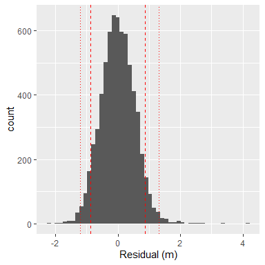
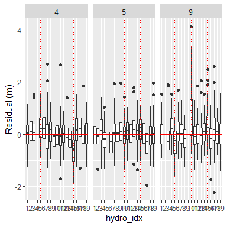
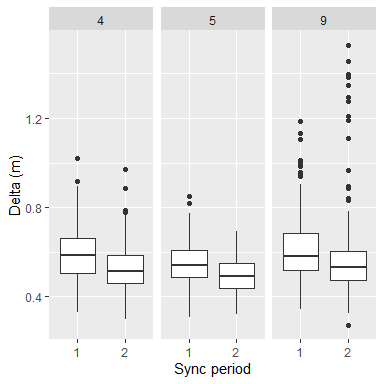
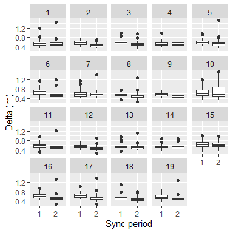

<!-- README_sync.md is generated from README_sync.Rmd. Please edit that file -->

# YAPS - How to use

### A complete walk-through taking you from raw data, through synchronization to final tracks

YAPS was introduced in 2017 as a manufacturer agnostic alternative to
proprietary and vendor specific options. The paper introducing YAPS can
be downloaded (open access)
[here](https://www.nature.com/articles/s41598-017-14278-z.pdf). While
YAPS is open-source and transparant, it is not (nor has it been intended
to be) a turn-key and/or a one-size-fits-all solution. Although the YAPS
model is open and transparent, the process from raw data downloaded from
hydrophones to final tracks is long and sometimes challenging.
Especially, the very important synchronization of hydrophone arrays have
proven to be a major obstacle for many potential users.

This how-to guide walks through the entire workflow from raw data
collected by PPM-based systems (Vemco VR2/VPS) to final tracks. The
walk-through shows how to use new functions added to YAPS enabling an
easy and approachable (but fine tuned) synchronization.

Click here for the [old readme with example using simulated
data](https://github.com/baktoft/yaps)

## Disclaimer

We have attempted to make both synchronization process and track
estimation user-friendly. However, it is far from trivial to synchronize
hydrophones (let alone automating the process) based on detections in a
variable and often noisy environment. Hydrophones might be
replaced/shifted and if not fixed securely, hydrophones might move/be
moved during a study. Additionally, hydrophone performance and output
format varies considerably between (and within) manufacturers. On top of
that, hydrophones don’t always behave and perform as expected. For
instance, some models autonomously initiate reboots causing perturbation
of varying magnitude and/or duration of the internal clock at apparently
random time intervals. Therefore, the functions in YAPS might perform
sub-optimal or even fail miserably when applied to new data. If/when
this happens, please let us know through a direct message or leave a
bug-report. Also note, the to-do list for improvements and tweaks is
long and growing, so stay tuned for updates.

### About synchronization in YAPS

Regardles of positioning algorithm used, synchronization of the
hydrophone array prior to track estimation is *extremely* important for
quality of the final tracks and great care should be taken to achieve as
good as possible sync. The sync method included in YAPS has several
benefits. First of all, it *synchronizes all hydrophones in one go*,
avoiding sequential propagating synchronization that might lead to error
accumulation in the outer ends of the array. Additionally, it allows for
*estimation of hydrophone positions*, which can be usefull if the
initial hydrophone positions are uncertain e.g. due to deep water,
strong current or low-level GPS. The internal clock in all hydrophones
drift in different directions and with varying speeds affected by water
temperature. Therefore, temporally varying non-linear correction is
needed. The sync method employed by YAPS is based on a user-specified
number of hydrophone-specific second-order polynomials. This approach,
in combination with the whole-array-at-once, have proved to give very
good synchronization. Perhaps most importantly, synchronization in YAPS
is aimed at being user-friendly. To meet this, we have tried to keep all
the nitty-gritty stuff inside easy-to-use functions and kept the amount
of user decisions at a minimum.

## Installation

Make sure you have the newest version of YAPS installed. For this, you
need `devtools` installed - if not already installed, run
`install.packages('devtools')`.  
YAPS relies heavily on use of Template Model Builder
[TMB](https://github.com/kaskr/adcomp) for fitting the models, so make
sure `TMB` is installed and working by following the simple [TMB
instructions](https://github.com/kaskr/adcomp/wiki/Download).  
Then install the latest version of YAPS with:

``` 
    # install.packages("devtools")
    # install.packages("TMB")
    # TMB::runExample(all=TRUE)
    devtools::install_github("baktoft/yaps")
    library(yaps)
```

## Included example data

Two data sets are included in YAPS serving as examples:

1.  **ssu1**: A tiny data set containing short test tracks from Florida
    Bay. 19 hydrophones, \~24 hour data, \~1 hour test track, Vemco VR2
    PPM. This data set is very small and simple, 2D only and perfect for
    testing purposes. See`?ssu1`for further info.

2.  **hald**: A larger data set from the Danish lake Hald Sø containing
    test and fish tracks. 70 hydrophones, 1 week data, \~1 hour test
    track, N fish tracks, Thelma TBR700 PPM. (Will be added).

### Data structure

Each data set is a list containing data.tables `hydros`, `detections`
and `gps`. See e.g. `?ssu1` for further infomation.  
For help to create these tables from raw data, look in `?prepDetections`
or [go here](#prepDetectionsHelp)

``` r
    head(ssu1$hydros, n=3)
#>    serial      x       y   z sync_tag idx
#> 1: 128344 525973 2771312 1.8       NA   1
#> 2: 128355 526136 2771277 1.5       NA   2
#> 3: 128361 526189 2771221 1.1       NA   3
    head(ssu1$detections, n=3)
#>                     ts   tag        epo  frac serial
#> 1: 2019-09-09 16:05:53 59335 1568045153 0.631 128368
#> 2: 2019-09-09 16:07:46 59334 1568045266 0.644 128368
#> 3: 2019-09-09 16:09:21 59337 1568045361 0.932 128368
    head(ssu1$gps, n=3)
#>                     ts    utm_x   utm_y
#> 1: 2019-09-09 18:02:18 526073.3 2771147
#> 2: 2019-09-09 18:02:19 526073.3 2771147
#> 3: 2019-09-09 18:02:25 526073.1 2771145
```

## Workflow from raw to synchronized data

1.  **Prepare data** list containing tables `hydros` and `detections` as
    described [here](#prepDetectionsHelp).

2.  **Define sync parameters**. Each data set is different in terms of
    e.g. array configuration, precission and accuracy of hydrophone
    positioning, acoustic environment and detection probability, sync
    tag configuration, manufacturer etc.
    
      - `max_epo_diff` Hydrophones are assumed to be running on at least
        somewhat similar time, so that ping trains from sync tags can be
        aligned correctly across all hydros. `max_epo_diff` sets the
        upper threshold for differences in TOA of sync tags. Best
        parameter value depends on burst rate of sync tags and how far
        apart the internal clocks of the hydros are prior to
        synchronization. A bit less than half of minimum sync tag burst
        rate is a good starting choice.
    
      - `min_hydros` To ensure connectivity throughtout the array, pings
        from sync tags need to be detected by multiple hydrophones and
        all hydrophones need to detect sync tags also detected by other
        hydrophones. `min_hydros` sets the lower threshold of how many
        hydrophones need to detect each sync tag ping in order to be
        included in the sync process. Should be as high as possible
        while observing that all hydrosphones are contributing. If too
        low, isolated hydrophones risk falling out completely. Future
        versions will work towards automising this.
    
      - `time_keeper_idx` Index of the hydrophone to use as time keeper.
        Could e.g. be the one with smallest overall clock-drift.
    
      - `fixed_hydros_idx` Vector of hydro idx’s for all hydrophones
        where the position is assumed to be known with adequate accuracy
        and precission. Include as many as possible as fixed hydros to
        reduce overall computation time and reduce overall variability.
        As a bare minimum two hydros need to be fixed, but we strongly
        advice to use more than two.
    
      - `n_offset_day` Specifies the number of hydrophone specific
        quadratic polynomials to use per day. For PPM based systems, 1
        or 2 is often adeqaute.
    
      - `n_ss_day` Specifies number of speed of sound to estimate per
        day. Future versions will enable use of logged water temperature
        instead. However, estimating SS gives an extra option for
        sanity-checking the final sync-model.
    
      - `keep_rate` Syncing large data sets can take a long time.
        However, there is typically an excess number of sync tag
        detections and a sub-sample is typically enough for good
        synchronization. This parameter specifies the proportion (0-1)
        of data to keep when sub-sampling.

3.  **Compile input data** for the sync process using `getInpSync()`.

4.  **Run** the sync model using `getSyncModel()`. This can take a long
    time for larger data sets including more hydrophones and/or covering
    longer time periods. It might a good idea to start with the first
    few days to make sure everything looks ok before syncing the entire
    data set. Also consider the parameter `keep_rate` in `getInpSync()`.

5.  **Check** the sync model to ensure the array is synced well using
    functions `plotSyncModelResids()` and `plotSyncModelCheck()`. These
    plots can be used to diagnose if the overall model fit is good.  
    Function `plotSyncModelResids()` plots sync model residuals (in
    meter) - sync model is ok if these residuals are centered closely
    around 0. If fixed hydros and/or sync tags consistently have large
    deviations from zero, it can indicate that position accuracy of the
    hydrophone is sub-optimal. Either obtain a better position
    (typically not possible) or allow th eposition to be non-fixed
    (i.e. remove from `fixed_hydros_idx`).  
    Function `plotSyncModelCheck()` apply the sync model to the sync
    data and compare true distances between hydros and sync tags to
    distances estimated based on the newly synced TOA-data.

6.  **Apply** the sync model to all data using `applySync()`.

The data should now be ready to be processed by YAPS to obtain estimated
tracks.

## Processing example data ssu1

### Synchronizing - ssu1

``` r
# 1. Already taken care as we are using example data.

# 2. set the parameters...
max_epo_diff <- 120
min_hydros <- 2
time_keeper_idx <- 5
fixed_hydros_idx <- c(2:3,6, 8,11,13:17)
n_offset_day <- 2
n_ss_day <- 2

# 3. get input data ready for getSyncModel()...
inp_sync <- getInpSync(sync_dat=ssu1, max_epo_diff, min_hydros, time_keeper_idx, fixed_hydros_idx, 
        n_offset_day, n_ss_day)

# 4. fit the sync model...
sync_model <- getSyncModel(inp_sync, silent=TRUE)
```

``` r
# 5a. Plot model residuals...
plotSyncModelResids(sync_model, by='overall')
plotSyncModelResids(sync_model, by='sync_tag')
plotSyncModelResids(sync_model, by='hydro')
```



``` r
# 5b. ...and model check plots...
plotSyncModelCheck(sync_model, by="sync_bin_sync")
plotSyncModelCheck(sync_model, by="sync_bin_hydro")
plotSyncModelCheck(sync_model, by="sync_tag")
plotSyncModelCheck(sync_model, by="hydro")
```



``` r
# 6. Apply the sync model to all detection data. Synced timestamps are found in column eposync
detections_synced <- applySync(toa=ssu1$detections, hydros=ssu1$hydros, sync_model)
head(detections_synced, n=3)
#>                     ts   tag        epo  frac serial hydro_idx    epofrac    eposync
#> 1: 2019-09-09 16:05:53 59335 1568045153 0.631 128368         6 1568045154 1568045154
#> 2: 2019-09-09 16:07:46 59334 1568045266 0.644 128368         6 1568045267 1568045267
#> 3: 2019-09-09 16:09:21 59337 1568045361 0.932 128368         6 1568045362 1568045362
```

### Running YAPS - ssu1

Finally, run the synchronized data through YAPS - needs a little
compiling beforehand.  
The only tracks to estimate from this data set is test tracks performed
to test feasibility of deploying an array at this location. In the
original data set, several transmitters with different power and burst
rates were used. Here we focus on a single of these: ID 15266, Vemco V9,
high power output, 20-40 second burst interval.

``` r
# We use the estimated positions of the hydros as they are assumed to be better
hydros_yaps <- data.table::data.table(sync_model$pl$TRUE_H)
colnames(hydros_yaps) <- c('hx','hy','hz')

# Specify focal tag and tag specific min and max burst intervals
focal_tag <- 15266
rbi_min <- 20
rbi_max <- 40

# Extract relevant data from the synced data
synced_dat_ssu1 <- detections_synced[tag == focal_tag]

# Compile TOA-matrix to use for YAPS
toa_ssu1 <- getToaYaps(synced_dat_ssu1, hydros_yaps, rbi_min, rbi_max)

# Compile all input data needed for YAPS
inp_ssu1 <- getInp(hydros_yaps, toa_ssu1, E_dist="Mixture", n_ss=2, pingType="rbi", sdInits=1, 
        rbi_min=rbi_min-5, rbi_max=rbi_max+5, ss_data_what="est", ss_data=0)

# Run YAPS to obtain estimated track
yaps_out_ssu1 <- runYaps(inp_ssu1, silent=TRUE) # Default parameter values should work for this example
```

### Plot YAPS results - ssu1

In plots below black and broken line is the gps (i.e. true track) while
red line is YAPS results.
<!-- -->

<!-- -->

-----

### Caveats, notes and hints

  - Current version assumes all sync tags are co-located with
    hydrophones (which is usually the case). If needed, future versions
    will allow for other options.
  - For non-fixed hydros, z is assumed to be known with much higher
    precision than x and y.
  - Only use data from periods where entire array is up, stationary and
    running - otherwise, make sure to NA invalid data…
  - Ensuring initial accuracy and precision of hydrophone positions is
    as good as possible is probably the easiest way to improve final
    results. We recommend to use a DGPS/GNSS instead of low-level
    consumer grade devices.

-----

## Appendix

#### How to create tables `hydros` and `detections`

The `detections` tables contain all detections and can be constructed
from csv-files exported from vendor software (remember to enable
millisecond time precision in export options, if needed). Assuming the
format follows the example shown below, the function `prepDetections()`
can be used. Data should be truncated to only cover the period you want
to synchronize - i.e. get rid of all detections before and after the
study period. Also consider to exclude data recorded while the system is
only partially in place - i.e. during putting out and downloading
hydrophones.  
There are surely many other formats out there - please tell us, if you
want a specific format added to `prepDetections()`. Future versions will
allow extraction of detections directly from the vendor provided SQLite
database.

``` r
    # Extract location of raw data included in yaps
    fn <- system.file("extdata", "VUE_Export_ssu1.csv", package="yaps") 
    vue <- data.table::fread(fn, fill=TRUE)
    head(vue, n=3)
#>        Date and Time (UTC)    Receiver    Transmitter Transmitter Name Transmitter Serial Sensor Value Sensor Unit Station Name Latitude Longitude
#> 1: 2019-09-09 16:04:11.193 VR2W-128355 A69-1602-59335               NA                 NA           NA          NA       CESI10       NA        NA
#> 2: 2019-09-09 16:04:12.574 VR2W-128371 A69-1602-59336               NA                 NA           NA          NA       CESI15       NA        NA
#> 3: 2019-09-09 16:04:43.953 VR2W-128959 A69-1602-59335               NA                 NA           NA          NA       CESI12       NA        NA
    detections <- prepDetections(raw_dat=vue, type="vemco_vue")
    head(detections, n=3)
#>                     ts   tag        epo frac serial
#> 1: 2019-09-09 16:04:11 59335 1568045051  193 128355
#> 2: 2019-09-09 16:04:12 59336 1568045053  574 128371
#> 3: 2019-09-09 16:04:43 59335 1568045084  953 128959
```

## TO DO

  - Add documentation to all functions…
  - Add temporal plot of residuals to plotSyncModelResids()
  - Change from ping to time in plotSyncModelCheck( by=“ping”)
  - update link to old readme, when the new one is online
  - Add figure showing hydrophone drifts to visualoze the need of sync
  - Add option to extract data from vendor SQLite
  - Add option to split large data set into smaller chunks for sync
  - Add a little background on positioning fish…
  - Add logo to github profile
  - Add functions to check rbi\_min, rbi\_max is correct and
    corresponding to what is in TOA when running YAPS
  - Add example data from Lake Hald\!\!\!
  - Seems to be something wrong with anchor-links in github-version…
  - Add network analysis to visualize array connectivity
  - Add logic to downsampleToaList() to optimize keeping remote hydros
    in
  - Add function checking for hydos with consistently large residuals in
    sync\_model and suggesting to make them non-fixed
  - Add function checkInpSync():
      - ensure all hydros have data for all offsets
  - Add spatial check and compile of sync-hydro-pairs to exclude from
    shape file
  - Improve getParamsXYFromCOA() by using an actual CoA-method instead
    of just averaging detecting hydros
  - Add description of hald data set and examples
  - Add details about tables hydros and gps in Appendix - how to prepare
    data
  - Add details to prepDetections()
  - Add 3D to both YAPS and sync\!\!\!
  - Move example data to external package and get YAPS on CRAN
  - Add list of papers actually using YAPS - incl. Vanwyck’s thesis
  - Add logo to github :-)
  - Build github pages
  - <https://github.com/kaskr/adcomp/issues/233>
